# greeting-card-miniprogram

[](https://github.com/BruceShang/greeting-card-miniprogram/stargazers)
[](https://github.com/BruceShang/greeting-card-miniprogram/blob/master/LICENSE)
[](https://github.com/BruceShang/greeting-card-miniprogram/releases)

# 项目简介

往来贺卡是一款微信小程序，专为用户提供精美的电子贺卡服务。用户可以选择各种场景的贺卡模板，添加个性化文字和特效，然后分享给亲友。小程序支持多种动画特效，如烟花、红包雨等，让传统的祝福方式焕发新意。无论是新年祝福、生日问候还是节日庆祝，往来贺卡都能帮助用户传递温暖与祝福。

## 技术架构

### 前端技术

- 框架: 微信小程序原生框架
- UI 组件: Vant Weapp
- 样式: SCSS
- 动画: CSS3 动画 + 自定义组件

### 后端技术

- 云开发: 微信云开发平台
- 数据库: 云数据库
- 存储: 云存储（存储贺卡图片等资源）
- 云函数: 处理业务逻辑和数据请求

## 主要依赖

- @vant/weapp: UI 组件库
- @cloudbase/wx-cloud-client-sdk: 云开发 SDK

## 项目结构

```pre
miniprogram/
├── components/           # 自定义组件
│   ├── navigation-bar/   # 自定义导航栏
│   ├── birthday-cake/    # 生日蛋糕动画组件
│   ├── fireworks/        # 烟花特效组件
│   ├── rocket/           # 火箭动画组件
│   ├── red-packet-rain/  # 红包雨组件
│   ├── bg-music/         # 背景音乐组件
│   └── open-process/     # VIP开通流程组件
├── images/               # 图片资源
├── pages/                # 页面
│   ├── index/            # 首页
│   ├── card-use/         # 贺卡编辑页
│   ├── card-result/      # 贺卡结果页
│   ├── card-favorites/   # 我的收藏页
│   ├── send-card/        # 发出的贺卡页
│   ├── received-list/    # 领取的贺卡页
│   ├── problem-feedback/ # 问题反馈
│   └── person-center/    # 个人中心页
├── utils/                # 工具函数
│   └── storage.ts        # 本地存储工具
├── app.json              # 小程序配置
├── app.ts                # 小程序入口
└── package.json          # 项目依赖
```

## 主要功能

### 贺卡浏览

- 分类展示: 按照不同场景和节日分类展示贺卡模板
- 热门推荐: 首页展示热门贺卡，方便用户快速选择
- 搜索功能: 支持按关键词搜索贺卡，如"新年祝福"、"生日"等
- VIP 专区: 特殊精美贺卡模板，仅 VIP 用户可用

### 贺卡编辑

- 文字编辑: 自定义贺卡标题和正文内容
- 祝福短语: 提供常用祝福语模板，一键套用
- 动画特效: 支持多种动态特效（烟花、红包雨、生日蛋糕、火箭等）
- 预览功能: 编辑过程中可随时预览效果

### 分享与收藏

- 一键分享: 支持分享给微信好友或朋友圈
- 收藏功能: 收藏喜欢的贺卡模板，方便下次使用
- 发送记录: 查看历史发送的贺卡记录

### 用户系统

- 用户信息: 自动获取微信头像和昵称
- VIP 机制: 通过分享小程序可获得 VIP 资格
- 个人中心: 管理个人信息和使用记录

## 项目体验

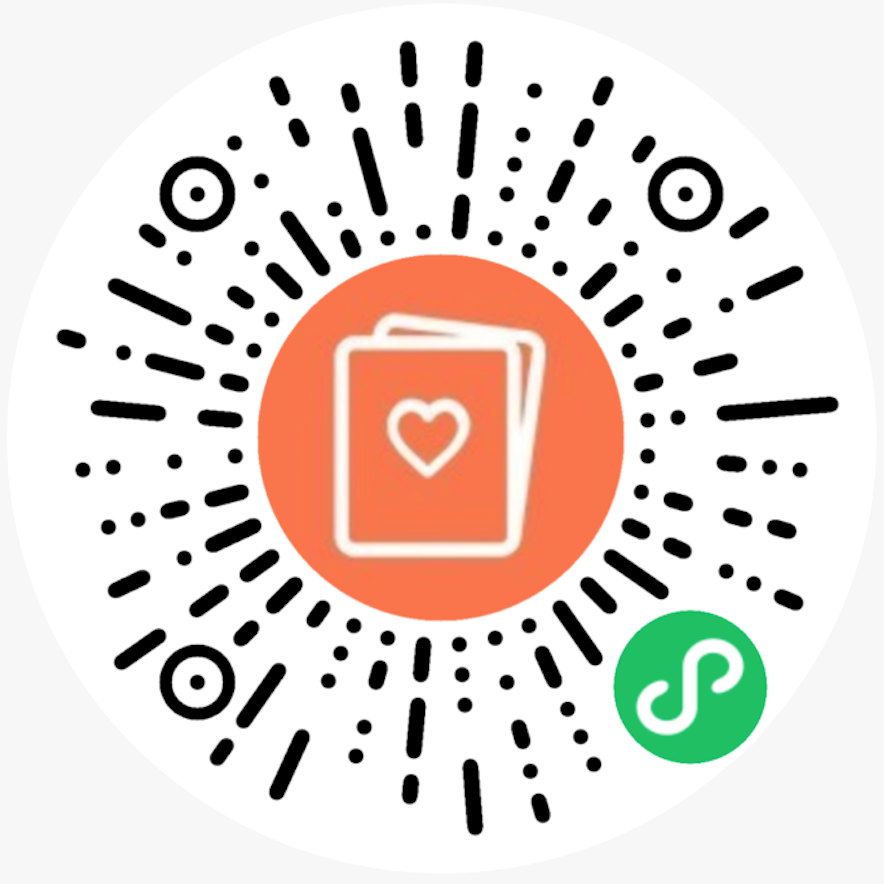

## 效果图


<table>
    <tr>
        <td>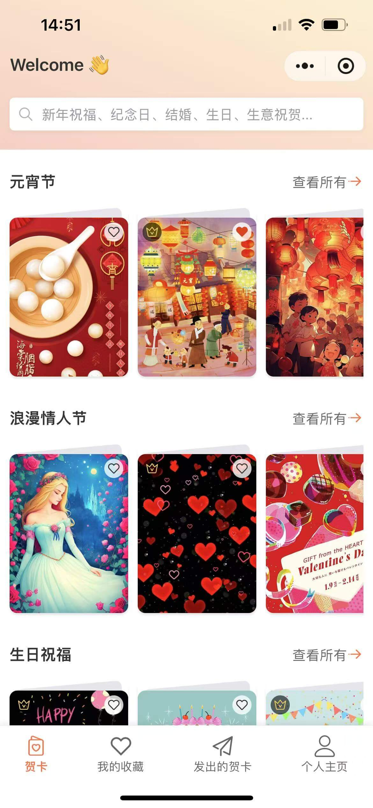</td>
        <td>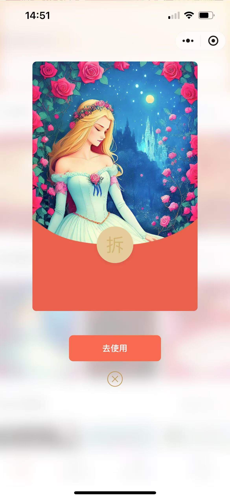</td>
        <td>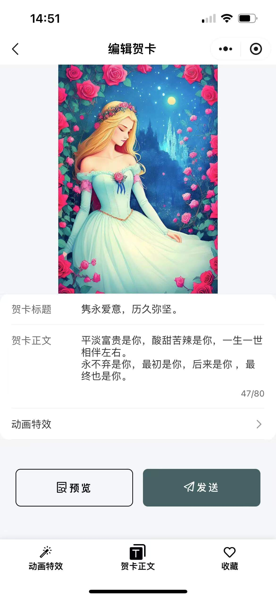</td>
    </tr>
    <tr>
        <td>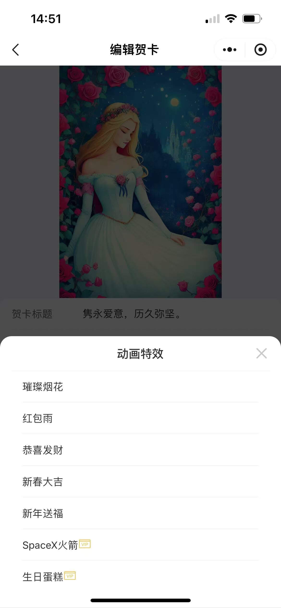</td>
        <td>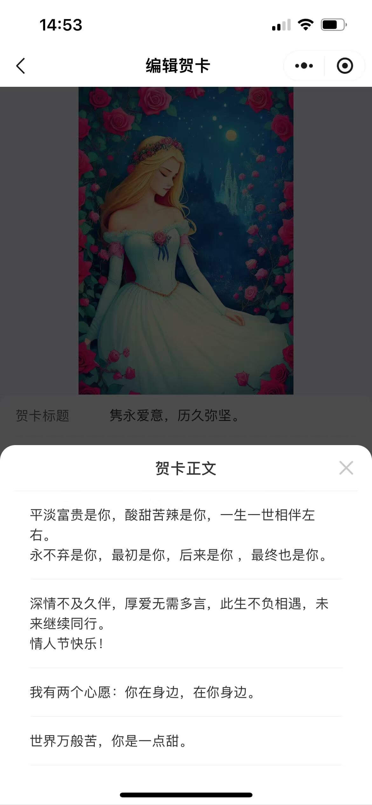</td>
        <td>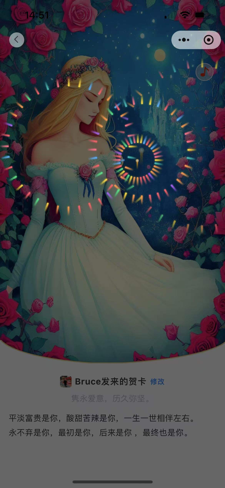</td>
    </tr>
    <tr>
        <td>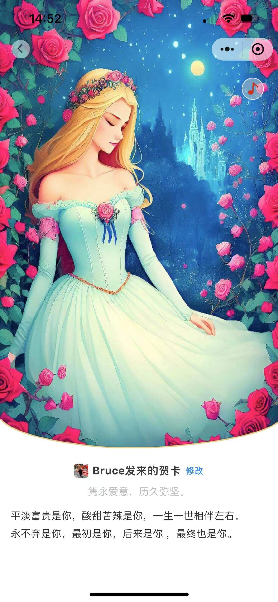</td>
        <td>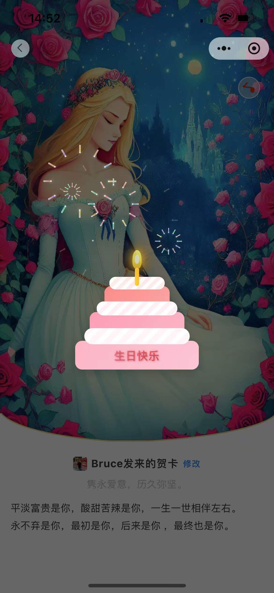</td>
        <td>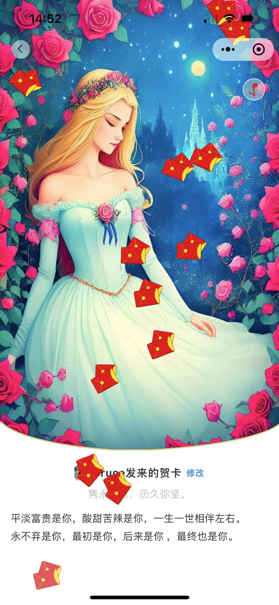</td>
    </tr>
    <tr>
        <td>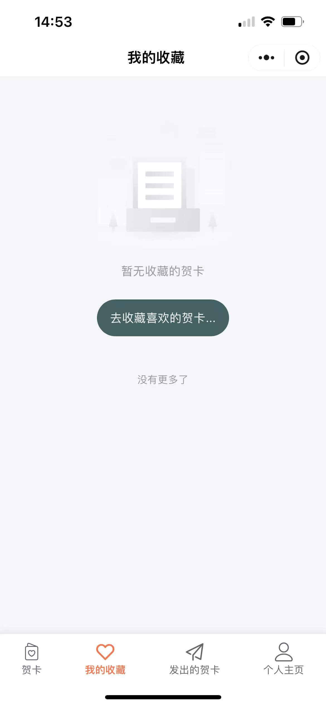</td>
        <td>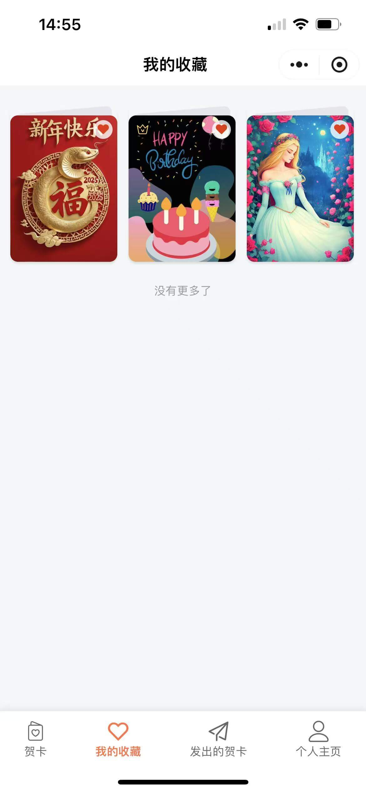</td>
        <td>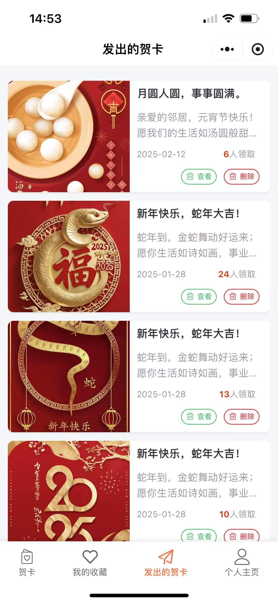</td>
    </tr>
    <tr>
        <td>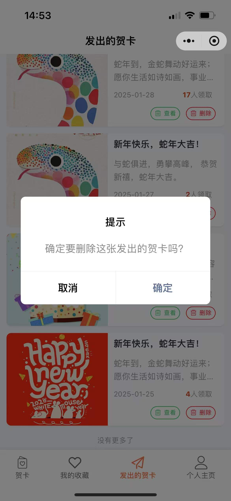</td>
        <td>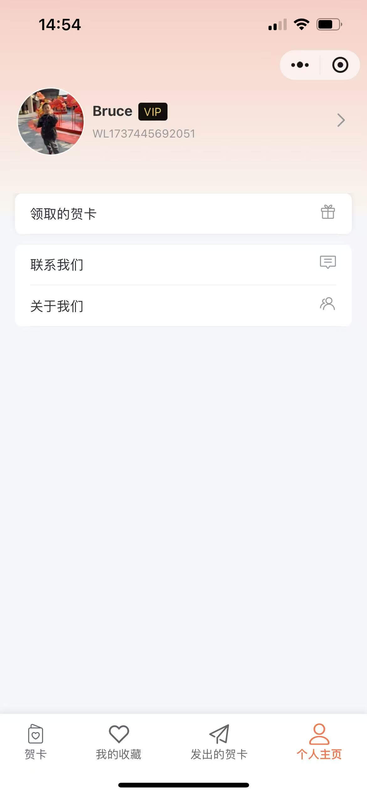</td>
        <td>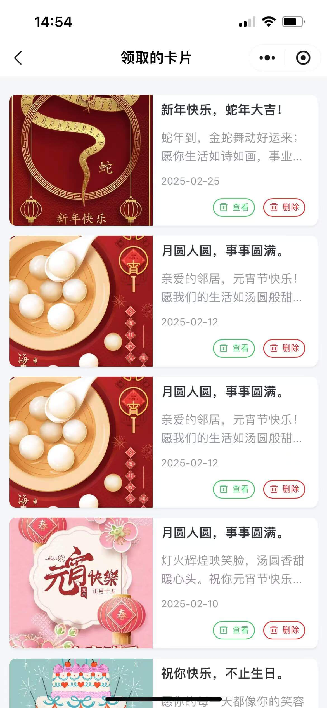</td>
    </tr>
    <tr>
        <td></td>
        <td>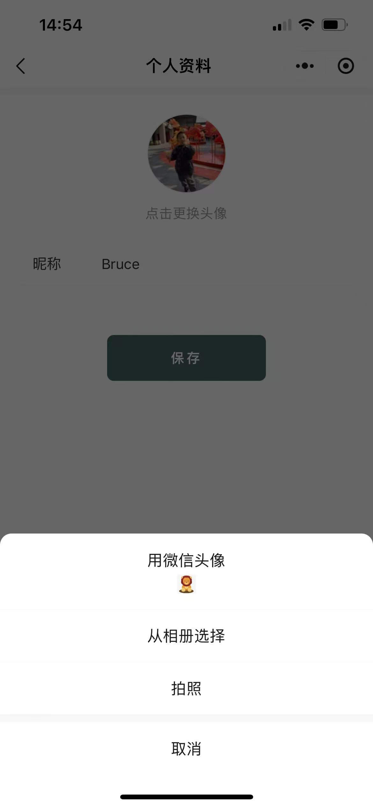</td>
        <td>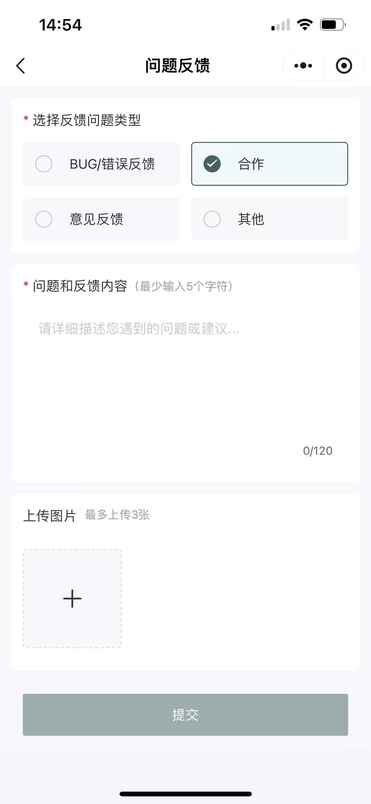</td>
    </tr>
    <tr>
        <td>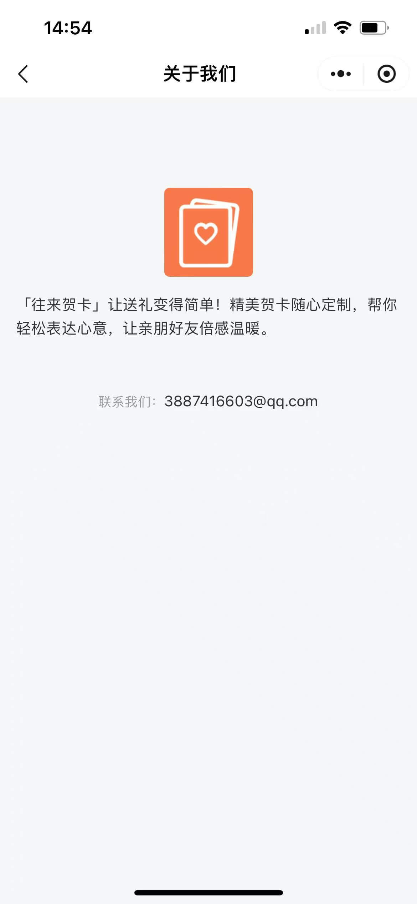</td>
        <td></td>
        <td></td>
    </tr>
</table>

## 安装与使用

### 开发环境要求

- 微信开发者工具
- Node.js (v12.0.0+)

### 安装步骤

1. 克隆仓库

```bash
git clone https://github.com/BruceShang/greeting-card-miniprogram.git
```

2. 切到项目目录

```bash
cd miniprogram
```

3. 安装依赖

```bash
npm install
```

3. 在微信开发者工具中导入项目

- 打开微信开发者工具
- 选择"导入项目"
- 选择项目目录
- 填入 AppID（可使用测试号）

  4.开启云开发

- 在微信开发者工具中创建云开发环境
- 初始化云数据库和存储

5. 运行小程序

- 在微信开发者工具中选择"预览"
- 使用微信扫一扫或真机测试

## 常见问题

Q: 如何获得 VIP 资格？
A: 通过分享小程序给好友，当好友使用您分享的贺卡时，您将获得 VIP 资格。

Q: 贺卡可以保存多久？
A: 贺卡将永久保存在云端，除非您主动删除。

Q: 可以自定义贺卡背景音乐吗？
A: 目前仅支持选择系统提供的背景音乐，未来版本将考虑添加自定义音乐功能。

## 许可证

本项目采用 [MIT 许可证](LICENSE) - 查看 LICENSE 文件了解更多详情。

## 致谢

- 感谢 Vant Weapp 团队提供的优秀 UI 组件库
- 感谢微信团队提供的小程序和云开发平台
- 感谢所有使用本小程序的用户，您的反馈是我们进步的动力
